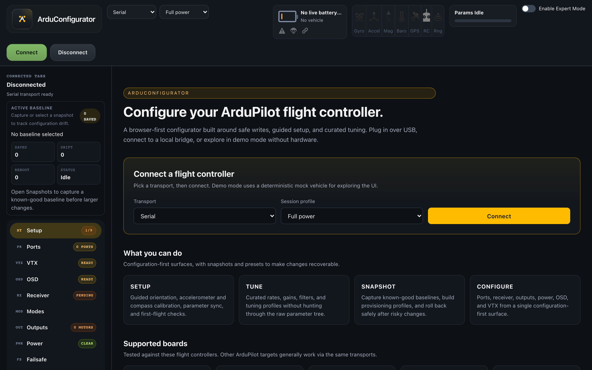
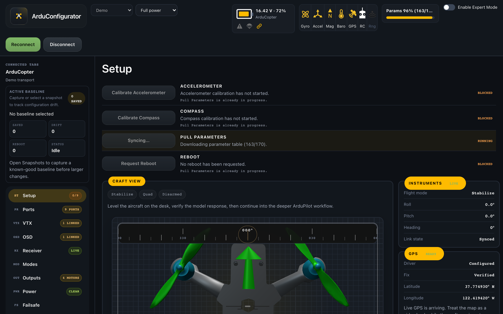

# ArduConfigurator

Browser-first ArduPilot configurator focused on setup and configuration for ArduCopter-first FPV workflows.

The project is aiming at the same category as `app.betaflight.com`, but for ArduPilot:

- web-first UI
- reusable TypeScript core/runtime
- safe configuration workflows
- narrow, curated tuning instead of a raw-parameter-first experience

## UI Preview

Pre-connect landing:



Connected Setup view, with Betaflight-style header sensor row and the curated configuration sidebar:



## How This Differs

ArduPilot already has adjacent configurator efforts, including:

- the older [`ArduPilot/ArduConfigurator`](https://github.com/ArduPilot/ArduConfigurator)
- the step-driven [`ArduPilot/MethodicConfigurator`](https://github.com/ArduPilot/MethodicConfigurator)

This repository is not pretending those efforts do not exist. The goal here is different:

- a browser-first product, rather than a Chrome-app-era or desktop-first toolchain
- a reusable backend split across transport, MAVLink/session, runtime, and metadata packages that can be reused by future tools
- an FPV-first configuration experience for ArduCopter-style hobby aircraft, especially the Betaflight-adjacent setup/configuration workflow
- stronger emphasis on verified writes, snapshots, guarded actions, and recoverability

This project is not trying to become a general-purpose GCS. The focus is a modern configuration app that makes ArduPilot more approachable for small multirotors while keeping the underlying runtime portable to future web tools or other ground-control surfaces.

Betaflight Configurator has also been used as a direct UI reference for parts of the FPV-oriented workflow, and the rotating craft preview models in [apps/web/public/models](apps/web/public/models) were copied from that project under their upstream GPL-compatible terms. See [apps/web/public/models/ATTRIBUTION.txt](apps/web/public/models/ATTRIBUTION.txt).

## Current State

The repository is beyond prototype stage, but not finished.

What is already real:

- browser `Web Serial` connection
- browser `WebSocket` connection to either an external MAVLink-over-WebSocket endpoint or the bundled local bridge started with `npm run bridge:websocket`
- a thin Electron desktop shell that hosts the same web app over localhost, including native snapshot-library open/save/export dialogs inside the shared `Snapshots` view
- real MAVLink v2 framing/parsing
- shared runtime for sync, writes, guided setup, snapshots, and presets
- a dedicated pre-connect landing surface that hosts the transport picker, supported-board grid, and capability overview while the user has not yet attached a flight controller
- a Betaflight-style header sensor row (gyro, accel, mag, baro, GPS, RC, rangefinder) wired to live runtime state
- read-only OSD preview HUD that renders live flight mode, battery, attitude, and link state in their conventional FPV positions
- dedicated `Modes` and `Failsafe` views that summarize FLTMODE assignments and RC/battery/advanced failsafe configuration in one place each
- guided setup with in-flow orientation checks, motor verification, and accelerometer calibration posture guidance
- live FC validation in the browser for `Ports`, `Receiver`, `Outputs`, `Snapshots`, `Presets`, and guarded motor test
- live FC validation for accelerometer calibration startup and first-pose progression, with QGroundControl-derived posture reference images in the web UI
- curated FPV tuning preset library (Cinematic Glide, Smooth Explorer, Balanced Baseline, Crisp Response, Gentle Acro, Balanced Acro, Sport Acro, Race Acro)
- automated mock, replay-session, and true SITL validation paths
- continuous integration on every PR running typecheck, the `node --test` unit suite, and the Playwright end-to-end suite

What is still missing:

- broader metadata/configuration coverage (GCS / EKF failsafe, multi-firmware mode tables, full per-element OSD parameter coverage)
- multi-firmware support beyond ArduCopter (Plane/Rover mode labels and curated views)
- packaging/distribution for the desktop shell
- release automation and packaged desktop artifacts

## Product Shape

The app is intentionally configuration-first.

Primary views today:

- `Setup`
- `Ports`
- `VTX`
- `OSD`
- `Receiver`
- `Modes`
- `Outputs`
- `Power`
- `Failsafe`
- `Snapshots`
- `Tuning`
- `Presets`
- `Parameters` (`Expert` mode)

The current tuning scope is intentionally narrow and curated. The main product focus remains setup, configuration, safety, and recoverability.

## Workspace Layout

- `apps/web`: browser UI, including `apps/web/src/views/` for the per-view components (`Modes`, `Failsafe`, `Vtx`, `Osd`, `Power`, `Presets`, `Outputs`) and `ScopedField` shared editor helper
- `apps/desktop`: thin Electron shell plus native adapters, CLI/runtime tooling, and SITL/live validation entrypoints
- `packages/transport`: transport adapters including mock, Web Serial, WebSocket, and replay
- `packages/protocol-mavlink`: MAVLink codec and session layer
- `packages/ardupilot-core`: runtime, setup logic, snapshots, presets, motor-test guardrails
- `packages/param-metadata`: metadata catalog, grouped views, curated parameter coverage
- `packages/mock-sitl`: deterministic mock runtime harness
- `packages/sitl-harness`: true ArduPilot SITL launch/attach utilities
- `tests`: integration and regression tests against built packages, including the Playwright end-to-end suite under `tests/e2e`

## Quick Start

Install dependencies:

```bash
npm install
```

Run the web app:

```bash
npm run dev:web
```

Run the thin desktop shell against the built web app:

```bash
npm run desktop:app
```

Run the thin desktop shell against the web dev server:

```bash
npm run dev:web
npm run desktop:app:dev
```

Run typecheck:

```bash
npm run typecheck
```

Run the unit suite:

```bash
npm run test
```

Run the Playwright end-to-end suite (builds the workspace, starts the preview server and the demo WebSocket bridge, runs the browser tests):

```bash
npm run test:e2e
```

Run true SITL validation with a local ArduPilot checkout:

```bash
ARDUPILOT_REPO_PATH=/path/to/ardupilot npm run test:sitl
```

## Validation Paths

- Mock runtime: fast regression coverage without hardware
- Replay transport: deterministic recorded-session validation without a live FC or SITL process
- Playwright end-to-end: browser-level regression coverage against the demo transport and the bundled WebSocket bridge, exercised in CI on every PR
- True SITL: direct-binary ArduPilot validation for real write/readback behavior
- Live FC: browser `Web Serial` and desktop runtime validation against actual hardware

Use the mock runtime, replay transport, Playwright e2e, true SITL, and live FC paths above as the validation ladder for changes, starting with the lowest-risk option that can prove the behavior.

## Safety

- Treat any live FC as a real aircraft, not a disposable dev board.
- Use read-only validation first.
- Do not run motor tests with propellers installed.
- Use snapshots/backups before risky live validation.

## Key References

- Architecture overview: [ARCHITECTURE.md](ARCHITECTURE.md)
- Contributor workflow: [CONTRIBUTING.md](CONTRIBUTING.md)
- Release and packaging guidance: [RELEASING.md](RELEASING.md)
- Support process: [SUPPORT.md](SUPPORT.md)
- Security policy: [SECURITY.md](SECURITY.md)
- Community expectations: [CODE_OF_CONDUCT.md](CODE_OF_CONDUCT.md)

## License

This repository is licensed under [GNU GPL v3.0 only](LICENSE).

The rotating craft preview models in [apps/web/public/models](apps/web/public/models) were copied from the Betaflight Configurator project and remain subject to their upstream GPL-compatible redistribution obligations. See [apps/web/public/models/ATTRIBUTION.txt](apps/web/public/models/ATTRIBUTION.txt).
